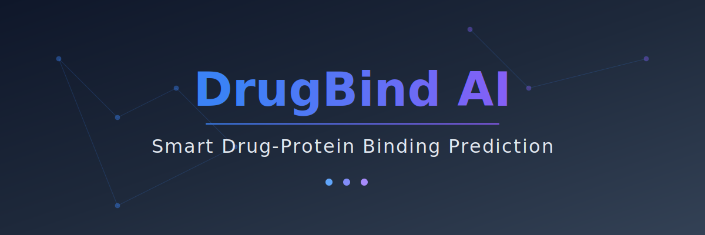

# DrugBind AI - Smart Drug-Protein Binding Prediction

[](https://opensource.org/licenses/MIT)
[](https://reactjs.org/)
[](https://www.typescriptlang.org/)
[](https://vitejs.dev/)

> An advanced AI-powered platform for predicting drug-protein binding affinities using deep learning. Combines Graph Neural Networks (GNN) for molecular representation with Transformer architectures for protein sequence encoding.



## 🎯 Overview

**DrugBind AI** is a comprehensive web application designed to accelerate drug discovery workflows by providing rapid, accurate predictions of binding interactions between small molecule compounds and protein targets. The platform achieves:

- **0.76 Pearson R** correlation with experimental data
- **25% RMSE reduction** over baseline models
- **>70% binding site overlap** with experimental structures
- **100,000+ training samples** from BindingDB and PDBbind

## ✨ Key Features

### 🎯 Smart Binding Prediction
- Predict drug-protein binding affinity (pK values)
- Input drug molecules via SMILES notation
- Input protein targets via FASTA sequences
- Real-time validation and AI-powered predictions
- Confidence scores and detailed interpretations

### 📊 Batch Processing
- Upload CSV/Excel files with multiple drug-protein pairs
- Process 100+ predictions simultaneously
- Real-time progress tracking with ETA
- Priority queue for urgent predictions
- Export results as CSV or Excel
- Automatic integration with prediction history

### 📜 Prediction History & Analytics
- Track, filter, and analyze all past predictions
- Interactive timeline view with date grouping
- Trend analytics charts (pK over time, source distribution)
- Export full history as JSON
- Manage favorites and add notes to predictions

### 🧠 AI Explainability
- SHAP-based atom importance visualization
- Protein residue contribution analysis
- 3D molecular structure viewer
- Attention heatmaps for model interpretability

### 🧪 Drug-Likeness Calculator
- Evaluate compounds against Lipinski's Rule of 5
- Calculate QED (Quantitative Estimate of Drug-likeness) scores
- Visualize molecular properties with radar charts
- Predict ADMET profile (Absorption, Toxicity, etc.)
- Detailed PDF report generation

### 📈 Model Performance Analytics
- Compare baseline vs deep learning models
- Interactive performance charts (RMSE, MAE, Pearson R, R²)
- Training/validation metrics visualization
- Model architecture diagrams

### 🗄️ Dataset Explorer
- Browse 10,000 curated drug-protein pairs
- Advanced filtering by source, pK range, protein family
- Export data as CSV/JSON
- Links to external databases (BindingDB, PDBbind, ChEMBL, UniProt)

### 📚 Complete Documentation
- Technical documentation with PDF export
- pK score interpretation guide
- Model architecture details
- API references and usage guidelines

## 🚀 Getting Started

### Prerequisites

- **Node.js** (v18 or higher) - [Download](https://nodejs.org/)
- **npm** or **bun** package manager

### Installation

1. **Clone the repository**
```bash
git clone https://github.com/YOUR_USERNAME/binding-insight-ai.git
cd binding-insight-ai
```

2. **Install dependencies**
```bash
npm install
# or
bun install
```

3. **Set up environment variables**

Create a `.env` file in the root directory (optional - the project includes default configuration):
```env
VITE_SUPABASE_PROJECT_ID=your_project_id
VITE_SUPABASE_PUBLISHABLE_KEY=your_publishable_key
VITE_SUPABASE_URL=your_supabase_url
```

4. **Start the development server**
```bash
npm run dev
```

The application will be available at `http://localhost:8080`

## 🛠️ Available Scripts

```bash
# Development server with hot reload
npm run dev

# Build for production
npm run build

# Build in development mode
npm run build:dev

# Preview production build
npm run preview

# Run linting
npm run lint

# Run tests
npm run test

# Run tests in watch mode
npm run test:watch
```

## 🏗️ Technology Stack

### Core Technologies
- **React 18.3.1** - UI framework
- **TypeScript 5.8.3** - Type-safe development
- **Vite 5.4.19** - Build tool and dev server
- **Tailwind CSS 3.4.17** - Utility-first CSS framework

### UI Components
- **shadcn/ui** - High-quality React components
- **Radix UI** - Accessible component primitives
- **Recharts 2.15.4** - Data visualization
- **Lucide React** - Icon library

### State Management & Data
- **TanStack React Query 5.83.0** - Server state management
- **React Hook Form 7.61.1** - Form handling
- **Zod 3.25.76** - Schema validation
- **Supabase 2.91.1** - Backend services

### Development Tools
- **ESLint** - Code linting
- **Vitest** - Unit testing
- **TypeScript ESLint** - TypeScript linting

## 📁 Project Structure

```
binding-insight-ai/
├── public/                 # Static assets
│   └── research/          # Research papers
├── src/
│   ├── components/        # React components
│   │   ├── ui/           # shadcn/ui components
│   │   ├── charts/       # Chart components
│   │   ├── prediction/   # Prediction interface
│   │   ├── explainability/ # Explainability visualizations
│   │   └── layout/       # Layout components
│   ├── pages/            # Application pages
│   ├── lib/              # Utility functions
│   ├── hooks/            # Custom React hooks
│   ├── data/             # Dataset samples
│   └── integrations/     # External integrations
├── .env                  # Environment variables
├── package.json          # Dependencies
├── vite.config.ts        # Vite configuration
├── tailwind.config.ts    # Tailwind configuration
└── tsconfig.json         # TypeScript configuration
```

## 🎨 Pages & Routes

| Route | Page | Description |
|-------|------|-------------|
| `/` | Landing | Platform overview and key features |
| `/prediction` | Prediction | Drug-protein binding prediction interface |
| `/history` | History | Prediction timeline, analytics, and management |
| `/drug-likeness` | Drug Likeness | Molecular property analysis and rule evaluation |
| `/explainability` | Explainability | AI model interpretability and visualization |
| `/performance` | Performance | Model comparison and analytics |
| `/dataset` | Dataset | Explore training datasets |
| `/documentation` | Documentation | Technical documentation |
| `/about` | About | Project information and contact |

## 📊 Model Architecture

### Deep Learning Pipeline
1. **Input Processing**: SMILES (drug) + FASTA (protein)
2. **Drug Encoding**: Graph Attention Network (3 layers, 256 dim)
3. **Protein Encoding**: Transformer (6 layers, 512 dim, 8 heads)
4. **Feature Fusion**: Cross-attention + Dense layers
5. **Output**: Binding affinity (pK) + confidence score

### Performance Metrics
- **RMSE**: 1.07 pK units (25% improvement over baseline)
- **MAE**: 0.82 pK units
- **Pearson R**: 0.76 (31% improvement)
- **R²**: 0.58 (71% improvement)

## 📚 Dataset Information

### Training Data
- **BindingDB**: 100,000 preprocessed samples (from 2.5M total)
- **PDBbind**: 10,000 validation samples (from 23K total)
- **ChEMBL**: Additional bioactivity data

### Data Sources
- [BindingDB](https://www.bindingdb.org) - Measured binding affinities
- [PDBbind](http://pdbbind.org.cn) - Protein-ligand complexes
- [RCSB PDB](https://www.rcsb.org) - 3D protein structures
- [UniProt](https://www.uniprot.org) - Protein sequences

## 🤝 Contributing

Contributions are welcome! Please feel free to submit a Pull Request.

1. Fork the repository
2. Create your feature branch (`git checkout -b feature/AmazingFeature`)
3. Commit your changes (`git commit -m 'Add some AmazingFeature'`)
4. Push to the branch (`git push origin feature/AmazingFeature`)
5. Open a Pull Request

## 📄 License

This project is licensed under the MIT License - see the [LICENSE](LICENSE) file for details.

## 👥 Authors

**Varun Agarwal**
- Student, Computer Science and Engineering (Cyber Security)
- RV College of Engineering®, Bengaluru, India
- Email: varunagarwal0964@gmail.com

**Research Mentor: Dr. A. H. Manjunatha Reddy**
- Professor, Department of Biotechnology
- RV College of Engineering®, Bengaluru, India
- Email: ahmanjunatha@rvce.edu.in

## 📖 Research Paper

**Title**: Smart Drug–Protein Binding Prediction using AI

**Abstract**: We present an end-to-end, interpretable pipeline for predicting drug–protein binding affinity from SMILES and FASTA inputs. The system combines graph-based encoders for ligands with transformer-derived representations for proteins, achieving significant improvements over traditional fingerprint-based methods.

**Download**: [Research Paper PDF](public/research/DrugBind_AI_Research_Paper.pdf)

## 🙏 Acknowledgments

- RV College of Engineering® for research support
- BindingDB, PDBbind, and ChEMBL for providing datasets
- The open-source community for excellent tools and libraries

## 📞 Contact

For questions, suggestions, or collaboration opportunities:
- **Email**: varunagarwal0964@gmail.com
- **Institution**: RV College of Engineering®, Bengaluru, India

---

**Made with ❤️ for advancing drug discovery through AI**
